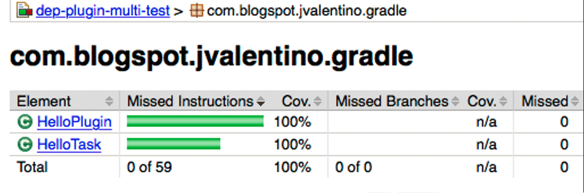

## 5.2 Common JaCoCo

Just as with the Codenarc plugin, the Jacoco plugin has been used in the various example project and involves the copying and pasting of boilerplate code. While the same approach can be used for creating a common Jacoco plugin to be applied across multiple projects, there first needs to be an understanding of how code coverage works in Groovy versus Java.

The purpose of this plugin is to demonstrate how to take the Jacoco settings currently present in all the example build.gradle files, and move it into a custom plugin. This includes the additional settings to handle ignore the coverage issues with Groovy closures.

#### build.gradle

```groovy
apply plugin: 'jacoco'

jacocoTestReport {
    doFirst {
        classDirectories = classDirectories.collect { 
            fileTree(it) { exclude '**/*$*_closure*' } 
        }.sum()
    }
	reports {
		xml.enabled true
		csv.enabled false
		html.enabled true
	}
}

jacocoTestCoverageVerification {
    doFirst {
        classDirectories = classDirectories.collect { 
            fileTree(it) { exclude '**/*$*_closure*' } 
        }.sum()
    }
}

```

This code represnets the entitery of the Jacoco confguration, including the ignore of closures for code coverage and code coverage veriifcation purposes. 

#### src/main/groovy/com/blogspot/jvalenitno/gradle/CustomJacocoPlugin.groovy

```groovy
class CustomJacocoPlugin implements Plugin<Project> {

    void apply(Project project) {
        project.configure(project) {
            apply plugin:'jacoco'

            afterEvaluate {
                jacocoTestReport {
                    doFirst {
                        classDirectories = classDirectories.collect {
                            fileTree(it) { exclude '**/*$*_closure*' }
                        }.sum()
                    }
                    reports {
                        xml.enabled true
                        csv.enabled false
                        html.enabled true
                    }
                }

                jacocoTestCoverageVerification {
                    doFirst {
                        classDirectories = classDirectories.collect {
                            fileTree(it) { exclude '**/*$*_closure*' }
                        }.sum()
                    }
                }
            }
        }
    }
}

```

Using the same strategy as was done with encapsulating Codenarc, the code can be placed with **afterEvaluate** in **project.configure**. The downside is that this code cannot be unit tested in this form. However, it is worth nothing that a unit test would not be entirely valuable, as what is occurring in an integration.

 

#### plugin-tests/local/build.gradle

```groovy
buildscript {
  repositories {
	jcenter()
  }
  dependencies {
    classpath 'com.blogspot.jvalentino.gradle:custom-jacoco:1.0.0'
  }
}

apply plugin: 'custom-jacoco'
apply plugin: 'groovy'

// GROOVY
version = '1.0.0'
group = 'com.blogspot.jvalentino.gradle'
archivesBaseName = 'hello-world-codenarc'

repositories {
    jcenter()
    mavenCentral()
}

dependencies {
    compile gradleApi()
    compile 'org.codehaus.groovy:groovy-all:2.4.12'

    testCompile 'org.spockframework:spock-core:1.1-groovy-2.4'
}

```

To test he plugin the same “Hello World” that includes codenarc is used to apply the test plugin, since there needs to be code and unit test to know if this works.

 

#### Manual Testing

```bash
plugin-tests/local$ gradlew test jacocoTestReport

> Task :test 

BUILD SUCCESSFUL

```

Running the test and report tasks from the command-line results in the unit test being run, and the coverage report being generated.

 

#### plugin-tests/local/build/reports/jacoco/test/html/index.html



That coverage report shows everything at 100%, with no closures being present


